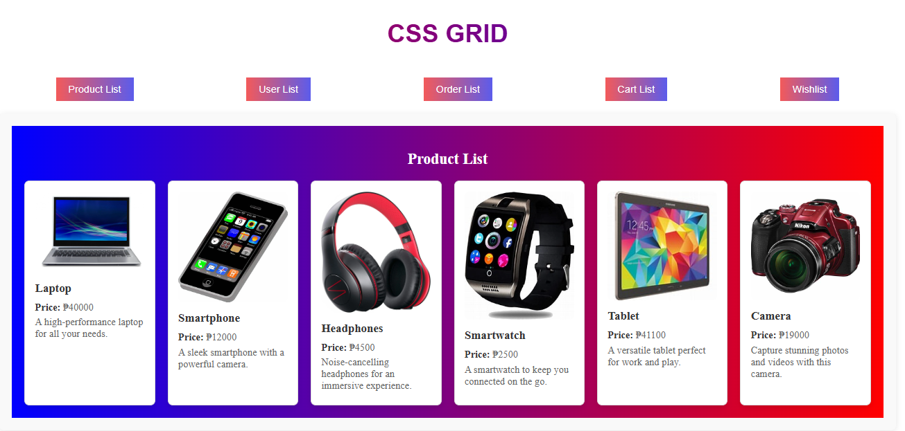
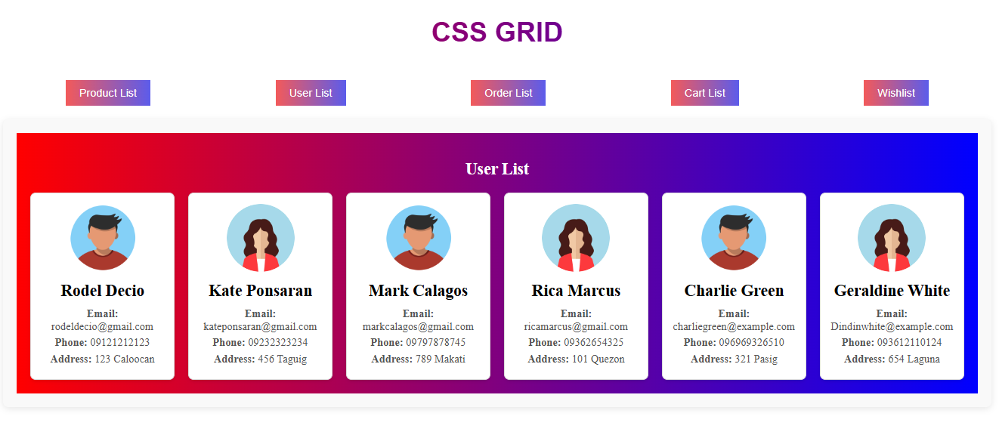
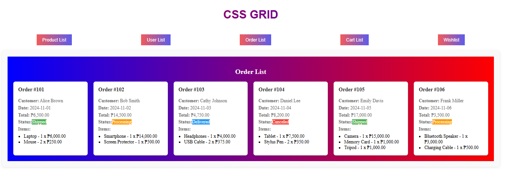
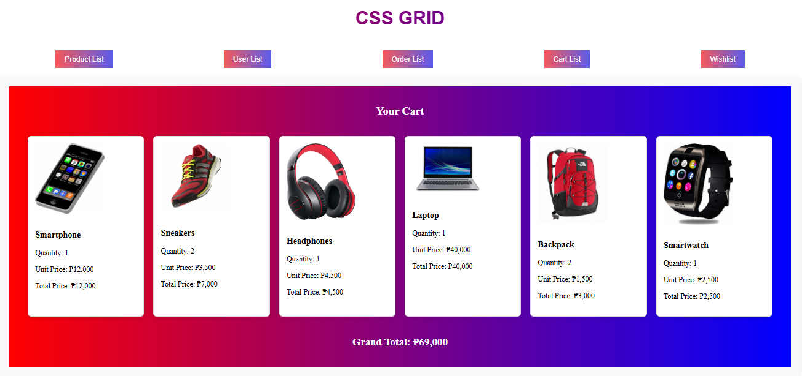
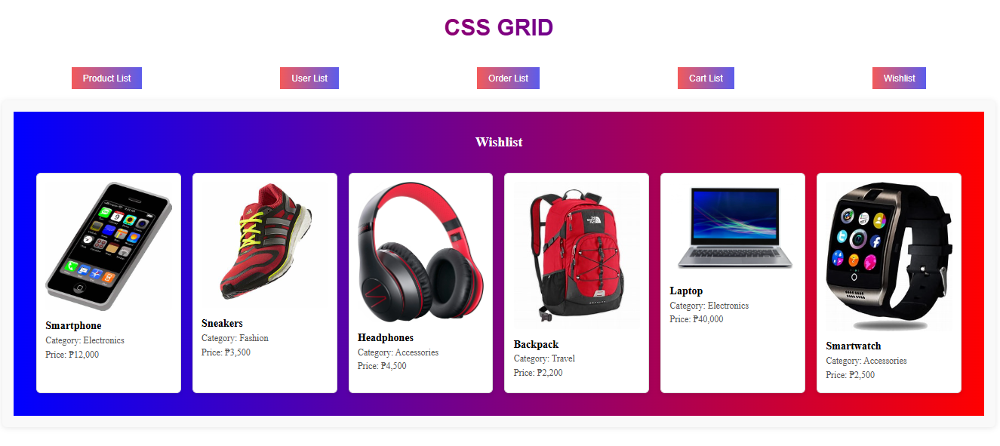

# CSS GRID
This project demonstrates a responsive layout using CSS Grid to create a user-friendly navigation and content structure. Each page in the project uses grid layouts for efficient and aesthetic placement of elements.

## Features
Responsive CSS Grid Layout: The project uses CSS Grid to create a flexible layout that adapts to different screen sizes.
Navigation Buttons: Buttons are arranged in a grid, allowing users to navigate between different lists (product list, user list, order list, cart list, wishlist).
Grid-Based List Pages: Each list page (like user list, product list) displays items in a CSS Grid format for clarity and easy access.
## CSS Grid Overview
CSS Grid is a CSS layout method that enables the creation of complex, responsive web layouts by organizing content into rows and columns. This allows for precise control over item placement, alignment, and spacing.

## Key Concepts of CSS Grid
Grid Container: The element where the grid is applied (display: grid;). This becomes the main container that holds grid items.
Grid Items: These are the child elements of the grid container, automatically arranged in rows and columns based on the grid’s structure.
## Main CSS Grid Properties
display: grid;: Enables CSS Grid on the container.
Grid Template Columns: Defines the number and width of columns.
css

grid-template-columns: repeat(3, 1fr); /* Creates 3 equal-width columns */
Grid Template Rows: Defines the number and height of rows.
css

grid-template-rows: auto auto; /* Creates two rows with automatic height */
Gap: Adds spacing between rows and columns.
css

gap: 20px;
Grid Column and Row Span: Allows grid items to span multiple columns or rows.
css

grid-column: span 2; /* Spans item across 2 columns */
Grid Area: A shorthand for defining the position within the grid using row and column lines.
css

grid-area: 1 / 2 / 3 / 4;
Project Structure
HTML Layout
html

  <header class="header">CSS GRID</header>

  

    <button routerLink="/productlist">Product List</button>
    <button routerLink="/userlist">User List</button>
    <button routerLink="/orderlist">Order List</button>
    <button routerLink="/cartlist">Cart List</button>
    <button routerLink="/wishlist">Wishlist</button>
  

  <main class="content">
    <router-outlet></router-outlet>
  </main>

## CSS Layout
css

/* Main Container */
.container {
  display: grid;
  grid-template-rows: auto 1fr;
  grid-template-columns: 1fr;
  gap: 10px;
  min-height: 100vh;
  text-align: center;
}

/* Header */
.header {
  background-color: #333;
  color: white;
  padding: 20px;
  font-size: 2rem;
}

/* Navigation Buttons */
.nav-buttons {
  display: grid;
  grid-template-columns: repeat(auto-fill, minmax(120px, 1fr));
  gap: 10px;
  padding: 10px;
}

.nav-buttons button {
  padding: 10px;
  background-color: #5b9bd5;
  color: white;
  border: none;
  border-radius: 5px;
  cursor: pointer;
  transition: background-color 0.3s ease;
}

.nav-buttons button:hover {
  background-color: #4a8bd4;
}

/* Content Area */
.content {
  background-color: #f4f4f4;
  padding: 20px;
  border-radius: 8px;
}
## Explanation 
grid-template-rows: auto 1fr;: Defines the header to take only the space it needs, with the content area filling the rest of the viewport.
Responsive Buttons: The nav-buttons section is a responsive grid that adjusts button layout based on available screen space.
Gap Property: Ensures visual separation between elements, improving layout clarity and readability.

## Sample Output:

Productlist

Userlist

Orderlist

Cartlist

Wishlist

